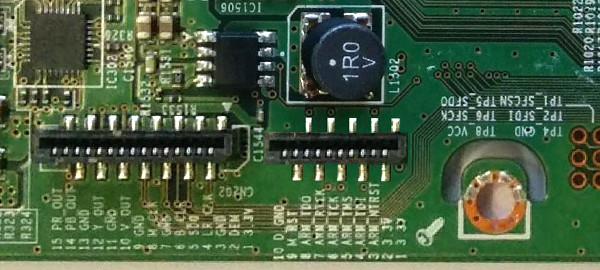

# BD-E6300


## Specifications
 * SDP1004 Firenze (Cortex-A9)


## Firmware

The firmware updates can be extracted with a [patched version](https://github.com/george-hopkins/samygo-patcher) of samygo-patcher.


## Applications

Most of the system is controlled by a single binary (`exeDSP`).

### Booting without an EEPROM

In case the EEPROM is blank or not connected, the system is still able to boot. However, the network can not be initialized due to an invalid MAC address (00:00:00:00:00:00). The address is stored at 0xFEBC. In addition, the multimedia player does not start up due to a missing RAM disk. This issue can be fixed in `CNeoMPDBUtil::OpenRamDisk()`.


## Debugging

The board probably had a JTAG connector during development. Before going into production, they simply deleted the footprint of the connector. All the traces are still there (up to the nearest via).



### OpenOCD

```text
source [find target/samsung_sdp1004.cfg]
```